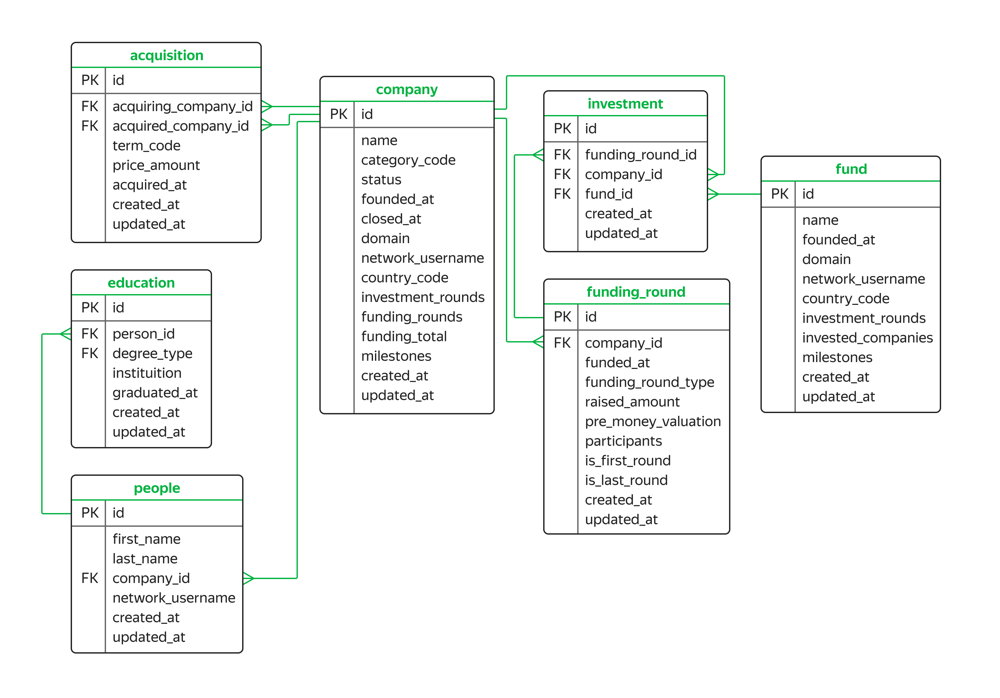

## Задания
В самостоятельном проекте вам нужно проанализировать данные о фондах и инвестициях и написать запросы к базе. Задания будут постепенно усложняться, но всё необходимое для их выполнения: операторы, функции, методы работы с базой — вы уже изучили на курсе. К каждому заданию будет небольшая подсказка: она направит вас в нужную сторону, но подробного плана действий не предложит.

## Схема базы данных



- acquisition
Содержит информацию о покупках одних компаний другими.
Таблица включает такие поля:
первичный ключ id — идентификатор или уникальный номер покупки;
внешний ключ acquiring_company_id — ссылается на таблицу company — идентификатор компании-покупателя, то есть той, что покупает другую компанию;
внешний ключ acquired_company_id — ссылается на таблицу company — идентификатор компании, которую покупают;
term_code — способ оплаты сделки:
cash — наличными;
stock — акциями компании;
cash_and_stock — смешанный тип оплаты: наличные и акции.
price_amount — сумма покупки в долларах;
acquired_at — дата совершения сделки;
created_at — дата и время создания записи в таблице;
updated_at — дата и время обновления записи в таблице.

-company
Содержит информацию о компаниях-стартапах.
первичный ключ id — идентификатор, или уникальный номер компании;
name — название компании;
category_code — категория деятельности компании, например:
news — специализируется на работе с новостями;
social — специализируется на социальной работе.
status — статус компании:
acquired — приобретена;
operating — действует;
ipo — вышла на IPO;
closed — перестала существовать.
founded_at — дата основания компании;
closed_at — дата закрытия компании, которую указывают в том случае, если компании больше не существует;
domain — домен сайта компании;
network_username — профиль фонда в корпоративной сети биржи;
country_code — код страны, например, USA для США, GBR для Великобритании;
investment_rounds — число раундов, в которых компания участвовала как инвестор;
funding_rounds — число раундов, в которых компания привлекала инвестиции;
funding_total — сумма привлечённых инвестиций в долларах;
milestones — количество важных этапов в истории компании;
created_at — дата и время создания записи в таблице;
updated_at — дата и время обновления записи в таблице.

- education
Хранит информацию об уровне образования сотрудников компаний.
первичный ключ id — уникальный номер записи с информацией об образовании;
внешний ключ person_id — ссылается на таблицу people — идентификатор человека, информация о котором представлена в записи;
degree_type — учебная степень, например:
BA — Bachelor of Arts — бакалавр гуманитарных наук;
MS — Master of Science — магистр естественных наук.
instituition — учебное заведение, название университета;
graduated_at — дата завершения обучения, выпуска;
created_at — дата и время создания записи в таблице;
updated_at — дата и время обновления записи в таблице.

- fund
Хранит информацию о венчурных фондах. 
первичный ключ id — уникальный номер венчурного фонда;
name — название венчурного фонда;
founded_at — дата основания фонда;
domain — домен сайта фонда;
network_username — профиль фонда в корпоративной сети биржи;
country_code — код страны фонда;
investment_rounds — число инвестиционных раундов, в которых фонд принимал участие;
invested_companies — число компаний, в которые инвестировал фонд;
milestones — количество важных этапов в истории фонда;
created_at — дата и время создания записи в таблице;
updated_at — дата и время обновления записи в таблице.

- funding_round
Содержит информацию о раундах инвестиций. 
первичный ключ id — уникальный номер инвестиционного раунда;
внешний ключ company_id — ссылается на таблицу company — уникальный номер компании, участвовавшей в инвестиционном раунде;
funded_at — дата проведения раунда;
funding_round_type — тип инвестиционного раунда, например:
venture — венчурный раунд;
angel — ангельский раунд;
series_a — раунд А.
raised_amount — сумма инвестиций, которую привлекла компания в этом раунде в долларах;
pre_money_valuation — предварительная, проведённая до инвестиций оценка стоимости компании в долларах;
participants — количество участников инвестиционного раунда;
is_first_round — является ли этот раунд первым для компании;
is_last_round — является ли этот раунд последним для компании;
created_at — дата и время создания записи в таблице;
updated_at — дата и время обновления записи в таблице.

- investment
Содержит информацию об инвестициях венчурных фондов в компании-стартапы.
первичный ключ id — уникальный номер инвестиции;
внешний ключ funding_round_id — ссылается на таблицу funding_round — уникальный номер раунда инвестиции;
внешний ключ company_id — ссылается на таблицу company — уникальный номер компании-стартапа, в которую инвестируют;
внешний ключ fund_id — ссылается на таблицу fund — уникальный номер фонда, инвестирующего в компанию-стартап;
created_at — дата и время создания записи в таблице;
updated_at — дата и время обновления записи в таблице.

- people
Содержит информацию о сотрудниках компаний-стартапов.
первичный ключ id — уникальный номер сотрудника;
first_name — имя сотрудника;
last_name — фамилия сотрудника;
внешний ключ company_id — ссылается на таблицу company — уникальный номер компании-стартапа;
network_username — профиль фонда в корпоративной сети биржи;
created_at — дата и время создания записи в таблице;
updated_at — дата и время обновления записи в таблице.

## Решения

## Запрос №1
**Описание:**

Отобразите все записи из таблицы `company` по компаниям, которые закрылись.

<table>
<thead>
<tr><td>Code<td>Result</tr>
</thead>
<tbody>
<tr>
<td>

```sql
SELECT *
FROM company
WHERE status = 'closed';
```
<td>  
   

</tr>
</tbody>
</table>

## Запрос №2
**Описание:**

Отобразите количество привлечённых средств для новостных компаний США. Используйте данные из таблицы `company`. Отсортируйте таблицу по убыванию значений в поле `funding_total`.

<table>
<thead>
<tr><td>Code<td>Result</tr>
</thead>
<tbody>
<tr>
<td>

```sql
SELECT funding_total
FROM company
WHERE category_code = 'news'
    AND country_code = 'USA'
ORDER BY funding_total DESC;
```
<td>  
   

</tr>
</tbody>
</table>

## Запрос №3
**Описание:**

Найдите общую сумму сделок по покупке одних компаний другими в долларах. Отберите сделки, которые осуществлялись только за наличные с 2011 по 2013 год включительно.

<table>
<thead>
<tr><td>Code<td>Result</tr>
</thead>
<tbody>
<tr>
<td>

```sql
SELECT SUM(price_amount)
FROM acquisition
WHERE EXTRACT(YEAR FROM acquired_at) BETWEEN 2011 AND 2013
    AND term_code = 'cash';
```
<td>  
   

</tr>
</tbody>
</table>

## Запрос №4
**Описание:**

Отобразите имя, фамилию и названия аккаунтов людей в поле `network_username`, у которых названия аккаунтов начинаются на `Silver`.

<table>
<thead>
<tr><td>Code<td>Result</tr>
</thead>
<tbody>
<tr>
<td>

```sql
SELECT first_name,
    last_name,
    network_username
FROM people
WHERE network_username LIKE 'Silver%';
```
<td>  
   

</tr>
</tbody>
</table>

## Запрос №5
**Описание:**

Выведите на экран всю информацию о людях, у которых названия аккаунтов в поле `network_username` содержат подстроку `money`, а фамилия начинается на `K`.

<table>
<thead>
<tr><td>Code<td>Result</tr>
</thead>
<tbody>
<tr>
<td>

```sql
SELECT *
FROM people
WHERE network_username LIKE '%money%'
    AND last_name LIKE 'K%';
```
<td>  
   

</tr>
</tbody>
</table>

## Запрос №6
**Описание:**

Для каждой страны отобразите общую сумму привлечённых инвестиций, которые получили компании, зарегистрированные в этой стране. Страну, в которой зарегистрирована компания, можно определить по коду страны. Отсортируйте данные по убыванию суммы.

<table>
<thead>
<tr><td>Code<td>Result</tr>
</thead>
<tbody>
<tr>
<td>

```sql
SELECT country_code AS country,
    SUM(funding_total) AS total
FROM company
GROUP BY country
ORDER BY total DESC;
```
<td>  
   

</tr>
</tbody>
</table>

## Запрос №7
**Описание:**

Составьте таблицу, в которую войдёт дата проведения раунда, а также минимальное и максимальное значения суммы инвестиций, привлечённых в эту дату.
Оставьте в итоговой таблице только те записи, в которых минимальное значение суммы инвестиций не равно нулю и не равно максимальному значению.

<table>
<thead>
<tr><td>Code<td>Result</tr>
</thead>
<tbody>
<tr>
<td>

```sql
SELECT funded_at AS date,
    MIN(raised_amount),
    MAX(raised_amount)
FROM funding_round
GROUP BY date
HAVING MIN(raised_amount) != 0
    AND MIN(raised_amount) != MAX(raised_amount);
```
<td>  
   

</tr>
</tbody>
</table>

## Запрос №8
**Описание:**

Создайте поле с категориями:
* Для фондов, которые инвестируют в 100 и более компаний, назначьте категорию `high_activity`.
* Для фондов, которые инвестируют в 20 и более компаний до 100, назначьте категорию `middle_activity`.
* Если количество инвестируемых компаний фонда не достигает 20, назначьте категорию `low_activity`.
Отобразите все поля таблицы `fund` и новое поле с категориями.

<table>
<thead>
<tr><td>Code<td>Result</tr>
</thead>
<tbody>
<tr>
<td>

```sql
SELECT *,
    CASE
        WHEN invested_companies >= 100 THEN 'high_activity'
        WHEN invested_companies >= 20 
            AND invested_companies < 100 THEN 'middle_activity'
        WHEN invested_companies < 20 THEN 'low_activity'
    END
FROM fund;
```
<td>  
   

</tr>
</tbody>
</table>

## Запрос №9
**Описание:**

Для каждой из категорий, назначенных в предыдущем задании, посчитайте округлённое до ближайшего целого числа среднее количество инвестиционных раундов, в которых фонд принимал участие. Выведите на экран категории и среднее число инвестиционных раундов. Отсортируйте таблицу по возрастанию среднего.

<table>
<thead>
<tr><td>Code<td>Result</tr>
</thead>
<tbody>
<tr>
<td>

```sql
WITH
    f AS (SELECT *,
                CASE
                    WHEN invested_companies>=100 THEN 'high_activity'
                    WHEN invested_companies>=20 THEN 'middle_activity'
                    ELSE 'low_activity'
                END AS activity
            FROM fund)

SELECT activity,
    ROUND(AVG(investment_rounds)) AS mean
FROM f
GROUP BY activity
ORDER BY mean;
```
<td>  
   

</tr>
</tbody>
</table>

## Запрос №10
**Описание:**

Проанализируйте, в каких странах находятся фонды, которые чаще всего инвестируют в стартапы. 
Для каждой страны посчитайте минимальное, максимальное и среднее число компаний, в которые инвестировали фонды этой страны, основанные с 2010 по 2012 год включительно. Исключите страны с фондами, у которых минимальное число компаний, получивших инвестиции, равно нулю. 
Выгрузите десять самых активных стран-инвесторов: отсортируйте таблицу по среднему количеству компаний от большего к меньшему. Затем добавьте сортировку по коду страны в лексикографическом порядке.

<table>
<thead>
<tr><td>Code<td>Result</tr>
</thead>
<tbody>
<tr>
<td>

```sql
SELECT country_code,
    MIN(invested_companies),
    MAX(invested_companies),
    AVG(invested_companies)
FROM fund 
WHERE EXTRACT(year from founded_at) BETWEEN 2010 AND 2012
GROUP BY country_code
HAVING MIN(invested_companies) != 0
ORDER BY AVG(invested_companies) DESC, country_code
LIMIT 10;
```
<td>  
   

</tr>
</tbody>
</table>

## Запрос №11
**Описание:**

Отобразите имя и фамилию всех сотрудников стартапов. Добавьте поле с названием учебного заведения, которое окончил сотрудник, если эта информация известна.

<table>
<thead>
<tr><td>Code<td>Result</tr>
</thead>
<tbody>
<tr>
<td>

```sql
SELECT p.first_name,
    p.last_name,
    e.instituition
FROM people AS p LEFT JOIN education AS e ON p.id=e.person_id;
```
<td>  
   

</tr>
</tbody>
</table>

## Запрос №12
**Описание:**

Для каждой компании найдите количество учебных заведений, которые окончили её сотрудники. Выведите название компании и число уникальных названий учебных заведений. Составьте топ-5 компаний по количеству университетов.

<table>
<thead>
<tr><td>Code<td>Result</tr>
</thead>
<tbody>
<tr>
<td>

```sql
WITH 
    ep AS (SELECT company_id,
                COUNT(DISTINCT(e.instituition))
            FROM people AS p 
            LEFT OUTER JOIN education AS e ON p.id = e.person_id
            GROUP BY company_id)

SELECT c.name,
    ep.count AS count
FROM company as c INNER JOIN ep ON ep.company_id = c.id
ORDER BY count DESC
LIMIT 5;
```
<td>  
   

</tr>
</tbody>
</table>

## Запрос №13
**Описание:**

Составьте список с уникальными названиями закрытых компаний, для которых первый раунд финансирования оказался последним.

<table>
<thead>
<tr><td>Code<td>Result</tr>
</thead>
<tbody>
<tr>
<td>

```sql
SELECT name
from company
where id IN (SELECT DISTINCT(id)
                FROM company
                WHERE status = 'closed')
    and id in (SELECT company_id
                FROM funding_round
                WHERE is_first_round = 1
                    ANd is_last_round = 1);
```
<td>  
   

</tr>
</tbody>
</table>

## Запрос №14
**Описание:**

Составьте список уникальных номеров сотрудников, которые работают в компаниях, отобранных в предыдущем задании.

<table>
<thead>
<tr><td>Code<td>Result</tr>
</thead>
<tbody>
<tr>
<td>

```sql
SELECT DISTINCT(p.id)
FROM people AS p
WHERE company_id IN (SELECT id as id_company_closed
                    from company
                    where id IN (SELECT DISTINCT(id)
                                    FROM company
                                    WHERE status = 'closed')
                        and id in (SELECT company_id
                                    FROM funding_round
                                    WHERE is_first_round = 1
                                        ANd is_last_round = 1));
```
<td>  
   

</tr>
</tbody>
</table>

## Запрос №15
**Описание:**

Составьте таблицу, куда войдут уникальные пары с номерами сотрудников из предыдущей задачи и учебным заведением, которое окончил сотрудник.

<table>
<thead>
<tr><td>Code<td>Result</tr>
</thead>
<tbody>
<tr>
<td>

```sql
WITH 
per AS (SELECT DISTINCT(p.id)
        FROM people AS p
        WHERE company_id IN (SELECT id as id_company_closed
                            from company
                            where id IN (SELECT DISTINCT(id)
                                            FROM company
                                            WHERE status = 'closed')
                                and id in (SELECT company_id
                                            FROM funding_round
                                            WHERE is_first_round = 1
                                                ANd is_last_round = 1))
        )
SELECT DISTINCT(per.id),
    e.instituition
FROM per inner join education as e ON per.id = e.person_id;
```
<td>  
   

</tr>
</tbody>
</table>

## Запрос №16
**Описание:**

Посчитайте количество учебных заведений для каждого сотрудника из предыдущего задания. При подсчёте учитывайте, что некоторые сотрудники могли окончить одно и то же заведение дважды.

<table>
<thead>
<tr><td>Code<td>Result</tr>
</thead>
<tbody>
<tr>
<td>

```sql
WITH 
per AS (SELECT DISTINCT(p.id)
        FROM people AS p
        WHERE company_id IN (SELECT id as id_company_closed
                            from company
                            where id IN (SELECT DISTINCT(id)
                                            FROM company
                                            WHERE status = 'closed')
                                and id in (SELECT company_id
                                            FROM funding_round
                                            WHERE is_first_round = 1
                                                ANd is_last_round = 1))
        )

SELECT DISTINCT(per.id) AS person,
    COUNT(e.instituition)
FROM per inner join education as e ON per.id = e.person_id
GROUP BY person ;
```
<td>  
   

</tr>
</tbody>
</table>

## Запрос №17
**Описание:**

Дополните предыдущий запрос и выведите среднее число учебных заведений (всех, не только уникальных), которые окончили сотрудники разных компаний. Нужно вывести только одну запись, группировка здесь не понадобится.

<table>
<thead>
<tr><td>Code<td>Result</tr>
</thead>
<tbody>
<tr>
<td>

```sql
WITH 
per AS (SELECT DISTINCT(p.id)
        FROM people AS p
        WHERE company_id IN (SELECT id as id_company_closed
                            from company
                            where id IN (SELECT DISTINCT(id)
                                            FROM company
                                            WHERE status = 'closed')
                                and id in (SELECT company_id
                                            FROM funding_round
                                            WHERE is_first_round = 1
                                                ANd is_last_round = 1))
        ),

con AS (SELECT per.id AS person,
                COUNT(e.instituition) 
            FROM per inner join education as e ON per.id = e.person_id
            GROUP BY person )

SELECT AVG(count)
FROM con;
```
<td>  
   

</tr>
</tbody>
</table>

## Запрос №18
**Описание:**

Дополните предыдущий запрос и выведите среднее число учебных заведений (всех, не только уникальных), которые окончили сотрудники разных компаний. Нужно вывести только одну запись, группировка здесь не понадобится.

<table>
<thead>
<tr><td>Code<td>Result</tr>
</thead>
<tbody>
<tr>
<td>

```sql
WITH 
per AS (SELECT DISTINCT(p.id)
        FROM people AS p
        WHERE company_id IN (SELECT id as id_company_closed
                            from company
                            where id IN (SELECT DISTINCT(id)
                                            FROM company
                                            WHERE status = 'closed')
                                and id in (SELECT company_id
                                            FROM funding_round
                                            WHERE is_first_round = 1
                                                ANd is_last_round = 1))
        ),

con AS (SELECT per.id AS person,
                COUNT(e.instituition) 
            FROM per inner join education as e ON per.id = e.person_id
            GROUP BY person )

SELECT AVG(count)
FROM con;
```
<td>  
   

</tr>
</tbody>
</table>

## Запрос №19
**Описание:**

Составьте таблицу из полей:
* `name_of_fund` — название фонда;
* `name_of_company` — название компании;
* `amount` — сумма инвестиций, которую привлекла компания в раунде.
В таблицу войдут данные о компаниях, в истории которых было больше шести важных этапов, а раунды финансирования проходили с 2012 по 2013 год включительно.

<table>
<thead>
<tr><td>Code<td>Result</tr>
</thead>
<tbody>
<tr>
<td>

```sql
WITH
    name_com AS(SELECT name, id
                FROM company
                WHERE milestones > 6),
    our AS (SELECT company_id, raised_amount,
                id
            FROM funding_round
            WHERE EXTRACT(YEAR FROM funded_at) BETWEEN 2012 AND 2013)

SELECT f.name AS name_of_fund,
    c.name AS name_of_company,
    fr.raised_amount AS amount
FROM investment as i 
LEFT JOIN company AS c ON i.company_id = c.id
LEFT JOIN funding_round AS fr ON fr.id = i.funding_round_id
LEFT JOIN fund AS f ON i.fund_id = f.id
WHERE i.company_id IN (SELECT id
                    FROM company
                    WHERE milestones > 6)
    AND i.funding_round_id IN (SELECT id
                            FROM funding_round
                            WHERE EXTRACT(YEAR FROM funded_at) BETWEEN 2012 AND 2013);
```
<td>  
   

</tr>
</tbody>
</table>

## Запрос №20
**Описание:**

Выгрузите таблицу, в которой будут такие поля:
* название компании-покупателя;
сумма сделки;
* название компании, которую купили;
* сумма инвестиций, вложенных в купленную компанию;
* доля, которая отображает, во сколько раз сумма покупки превысила сумму вложенных в компанию инвестиций, округлённая до ближайшего целого числа.
Не учитывайте те сделки, в которых сумма покупки равна нулю. Если сумма инвестиций в компанию равна нулю, исключите такую компанию из таблицы. 
Отсортируйте таблицу по сумме сделки от большей к меньшей, а затем по названию купленной компании в лексикографическом порядке. Ограничьте таблицу первыми десятью записями.

<table>
<thead>
<tr><td>Code<td>Result</tr>
</thead>
<tbody>
<tr>
<td>

```sql
WITH 
bought AS (SELECT a.id,
                a.acquiring_company_id,
                a.price_amount,
                c.name
        FROM acquisition as a LEFT JOIN company AS c ON a.acquiring_company_id = c.id
        WHERE price_amount != 0),

sold AS (SELECT a.id,
                a.acquired_company_id,
                c.name,
                c.funding_total
        FROM acquisition as a LEFT JOIN company AS c ON a.acquired_company_id = c.id
        WHERE price_amount != 0
            AND funding_total != 0)

SELECT b.name AS bought,
    b.price_amount AS total_buy,
    s.name AS sold,
    s.funding_total AS invest,
    ROUND(b.price_amount / s.funding_total) AS rate
FROM bought AS b INNER JOIN sold AS s ON b.id=s.id
ORDER BY total_buy DESC, sold
LIMIT 10;
```
<td>  
   

</tr>
</tbody>
</table>

## Запрос №21
**Описание:**

Выгрузите таблицу, в которую войдут названия компаний из категории `social`, получившие финансирование с 2010 по 2013 год включительно. Проверьте, что сумма инвестиций не равна нулю. Выведите также номер месяца, в котором проходил раунд финансирования.

<table>
<thead>
<tr><td>Code<td>Result</tr>
</thead>
<tbody>
<tr>
<td>

```sql
WITH
ex AS (SELECT company_id,
            EXTRACT(MONTH from funded_at) as dat
        FROM funding_round
        WHERE EXTRACT(YEAR from funded_at) BETWEEN 2010 AND 2013
            AND raised_amount != 0)
SELECT name,
    ex.dat
FROM company AS c RIGHT JOIN ex ON ex.company_id = c.id 
WHERE c.category_code = 'social';
```
<td>  
   

</tr>
</tbody>
</table>

## Запрос №22
**Описание:**

Отберите данные по месяцам с 2010 по 2013 год, когда проходили инвестиционные раунды. Сгруппируйте данные по номеру месяца и получите таблицу, в которой будут поля:
* номер месяца, в котором проходили раунды;
количество уникальных 
* названий фондов из США, которые инвестировали в этом месяце;
* количество компаний, купленных за этот месяц;
* общая сумма сделок по покупкам в этом месяце.

<table>
<thead>
<tr><td>Code<td>Result</tr>
</thead>
<tbody>
<tr>
<td>

```sql
WITH  acq AS
(SELECT EXTRACT(month from acquired_at) as m,
    SUM(price_amount),
    COUNT(acquisition)
FROM acquisition
WHERE EXTRACT(year from acquired_at) BETWEEN 2010 and 2013
GROUP BY m),

roun AS 
(SELECT EXTRACT(month from fr.funded_at) as m,
    COUNT(DISTINCT(f.name)) as count_fund
FROM investment as i 
LEFT JOIN funding_round as fr ON i.funding_round_id = fr.id
LEFT JOIN fund AS f ON f.id = i.fund_id
WHERE EXTRACT(year from fr.funded_at) BETWEEN 2010 and 2013
    AND f.country_code = 'USA'
GROUP by m)

SELECT roun.m as month_trans,
    roun.count_fund as usa,
    acq.count as count_buy,
    acq.sum as sum_total

FROM acq right join roun ON acq.m = roun.m;
```
<td>  
   

</tr>
</tbody>
</table>

## Запрос №23
**Описание:**

Составьте сводную таблицу и выведите среднюю сумму инвестиций для стран, в которых есть стартапы, зарегистрированные в 2011, 2012 и 2013 годах. Данные за каждый год должны быть в отдельном поле. Отсортируйте таблицу по среднему значению инвестиций за 2011 год от большего к меньшему.

<table>
<thead>
<tr><td>Code<td>Result</tr>
</thead>
<tbody>
<tr>
<td>

```sql
WITH
     inv_2011 AS (SELECT country_code,
                        AVG(funding_total) as y2011
                FROM company
                WHERE EXTRACT(year from founded_at) = 2011
                GROUP BY country_code),
                 
     inv_2012 AS (SELECT country_code,
                        AVG(funding_total) as y2012
                FROM company
                WHERE EXTRACT(year from founded_at) = 2012
                GROUP BY country_code),

    inv_2013 AS (SELECT country_code,
                        AVG(funding_total) as y2013
                FROM company
                WHERE EXTRACT(year from founded_at) = 2013
                GROUP BY country_code)


SELECT inv_2011.country_code,
        inv_2011.y2011,
        inv_2012.y2012,
        inv_2013.y2013
       -- отобразите нужные поля
FROM inv_2011 
INNER JOIN inv_2012 ON inv_2011.country_code = inv_2012.country_code
-- укажите таблицу
INNER JOIN  inv_2013 ON  inv_2012.country_code = inv_2013.country_code-- присоедините таблицы
ORDER BY inv_2011.y2011 DESC;
```
<td>  
   

</tr>
</tbody>
</table>
